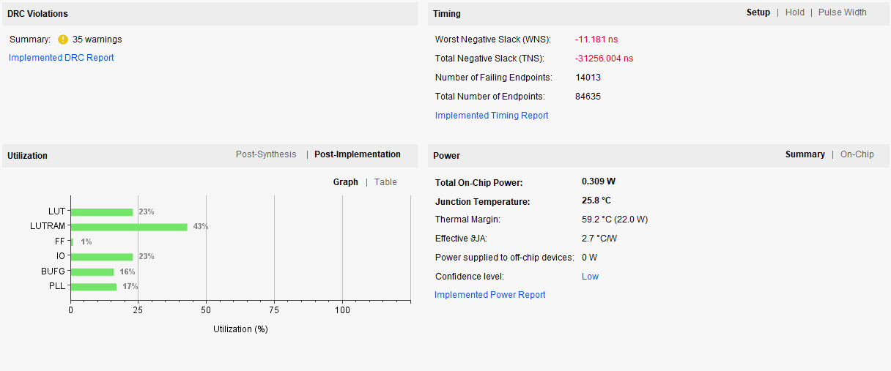

# [miniRV-1_Design] RISC-V架构CPU设计

## 项目简介
> 计算机设计与实践实验课，RISC-V子集miniRV-1的CPU设计
>
> 单周期CPU设计、流水线CPU设计
>
> [实验指导书网页](https://hitsz-cslab.gitee.io/organ/)
>
> [trace 测试网页](https://github.com/HITSZ-CDP-SU2021/cdp-tests)

## 环境搭建

* vivado
* verilog
* trace 比对使用虚拟机(linux)

## 项目文件夹说明

* **design_file**: 设计文件，包括数据通路表、数据通路框图、指令集等
* **download_test**: 已经综合过的 IROM 和 DRAM IP 核，测试用的
* **image**: 展示的图片
* **ex1**: 这是实验一的内容。RISC-V 汇编程序
* **ex2**: 这是实验二的内容。RISC-V 单周期 CPU 设计
  * **lab2**: 实验二的工程文件夹，可用 vivado 直接打开综合上板
  * **lab2_src_for_vm**: 实验二用于 trace 比对的源代码
* **ex3**: 这是实验三的内容。RISC-V 五级流水线CPU设计
  * **lab3**: 实验三的工程文件夹，可用 vivado 直接打开综合上板
  * **lab3_src_for_vm**: 实验三用于 trace 比对的源代码

## 使用说明

* 实验一中，通过 logisim 实验了一个 RISC-V 架构的 CPU，通过给 IROM 写机器码可以仿真

* 实验二中实现了单周期 miniRV-1 的 CPU，CPU 频率为 25 MHz（应该可以再往上提一点），用vivado打开后可以直接综合上板。trace 比对部分，直接将文件夹中源代码复制粘贴到虚拟机的 mycpu 文件夹中即可 make

* 实验三实现了五级流水线的 miniRV-1 的 CPU，CPU 频率为 70 MHz（感觉已经比较极限了，具体数据见下图），使用方法同实验二。

  

## 引用

* **image_1.jpg**: 引用自百度图片，如有侵权请联系 - [原网址](https://image.baidu.com/search/detail?ct=503316480&z=0&ipn=d&word=RISC-V%20%E5%9B%BE%E7%89%87&step_word=&hs=0&pn=1&spn=0&di=180510&pi=0&rn=1&tn=baiduimagedetail&is=0%2C0&istype=0&ie=utf-8&oe=utf-8&in=&cl=2&lm=-1&st=undefined&cs=2454626199%2C4288005620&os=2136804889%2C2843461907&simid=30986516%2C827252161&adpicid=0&lpn=0&ln=1558&fr=&fmq=1624985920546_R&fm=&ic=undefined&s=undefined&hd=undefined&latest=undefined&copyright=undefined&se=&sme=&tab=0&width=undefined&height=undefined&face=undefined&ist=&jit=&cg=&bdtype=0&oriquery=&objurl=https%3A%2F%2Fgimg2.baidu.com%2Fimage_search%2Fsrc%3Dhttp%3A%2F%2Fstatic.cena.com.cn%2Fattach%2Fimage%2F20190315%2F155261343058194771.jpg%26refer%3Dhttp%3A%2F%2Fstatic.cena.com.cn%26app%3D2002%26size%3Df9999%2C10000%26q%3Da80%26n%3D0%26g%3D0n%26fmt%3Djpeg%3Fsec%3D1627577928%26t%3D5171c67e42dc13b1c4d6ddfa5d7dea82&fromurl=ippr_z2C%24qAzdH3FAzdH3Fooo_z%26e3Bqtviwviw_z%26e3Bv54AzdH3Fr5fpgjof_nbb9dclb81cdvuda1lnjdw9w9k18j9n8_z%26e3Bip4s&gsm=2&rpstart=0&rpnum=0&islist=&querylist=&nojc=undefined)

## 感谢

感谢实验中心老师的指导！
