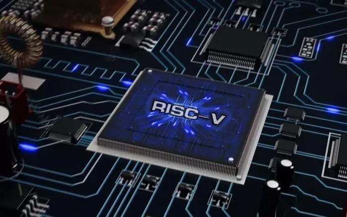

# [miniRV-1_Design] RISC-V架构CPU设计

### 项目简介
> 计算机设计与实践实验课，RISC-V子集miniRV-1的CPU设计
>
> 单周期CPU设计、流水线CPU设计
>
> [实验指导书网页](https://hitsz-cslab.gitee.io/organ/)

### 环境搭建

* 项目开发中，还不知道

### 项目文件夹说明

* **[xlsx]**: excel表格（miniRV-1的指令集表格、数据通路和控制信号表格等）

### 使用说明

* 项目开发中，暂无说明

